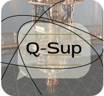

<p align="center">
  
</p>

# Q-Sup

> A messaging web application which implements Quantum Key Distribution for secure communication!

Original Link: https://github.com/Chasmiccoder/Q-Sup

## What is Quantum Key Distribution? 🤔
Key Distribution, in cryptography, is the process where two parties separated over a distance generate a key, which can be used to establish secure communication.

Classical methods like Diffie-Hellman Key exchange might be rendered unsafe once we get access to large scale, error free, quantum computers, which is why it is important to develop new protocols that are effectively 'quantum resistant'.

Quantum Key Distribution employs the use of quantum phenomena to generate the required key. What makes this special is that an evesdropper cannot intercept the protocols without performing a measurement on the qubits involved. If an unauthorized measurement is performed, we can detect it with certain methods and discard the compromised key.

## The Ekert-91 Protocol 🌌

Two of the most popular protocols in QKD are BB84 and E91. We decided to implement E91 in our project because under special circumstances the BB84 protocol can be compromised*. Also, the E91 protocol employs entanglement, which can be tested with the CHSH inequality for its effectiveness.

The problem with the current setup available is that the E91 protocol requires 2 quantum computers, so that both Alice and Bob can perform measurements on entangled qubits independently. We currently have access to 1 quantum computer, and need to implement the protocol for 1 qubit in one query. This is why we had to slightly modify E91 to fit the current circumstances.

Algorithm Employed -  
1. User 1 logs in and sends their measurement bases to an intermediate interface, which stores the sequence. Then user 1 waits for user 2 to do the same.
2. User 2 sends their measurement sequence to the intermediate interface and initiates the protocol.
3. The intermediate interface (python backend) creates the quantum circuit by first creating a Bell state, and then performing the respective measurements, and then sends this circuit to Quantum Inspire's hardware.
4. Quantum Inspire's processor performs the measurements and sends the measurement results back to the interface.
5. The intermediate interface sends the measurement results back to the respective users. Note that the users get access to only their set of measurements, and not the others'.
6. Both the users make their measurement sequences public, through a classical channel. This can be done even in the presence of an eavesdropper.
7. The users compare the two measurement sequences and obtain the sifted key, which can then be used for secure communication!

Assumptions -  
1. The initial procedure of sending the measurement bases to the intermediate interface is secure. A big 'if' for usage in real life.
2. The process of sending the quantum circuit from the intermediate interface to the quantum computer is secure.
3. The effect of noise on the generated key is low. Again, a big 'if' considering today's quantum computers.

\* If Eve has knowledge of the measurement bases used to encode the qubits, then she can intercept the qubits and get access to the key being distributed.  

## Installation of Q-Sup 🚀

After cloning the repository, create a virtual environment, and activate it.
```
pip install virtualenv
virtualenv venv
```

On Windows, powershell
```
.\venv\Scripts\activate.ps1
```

On Mac/Linux
```
source venv/bin/activate
```

Then install the required packages using the specified requirements.txt file
```
pip install -r requirements.txt
```

To launch the server and run the project,
```
python -m flask run
```

## Usage 💻

After launching the server, start a web browser and run the localhost address in 2 tabs
```
http://127.0.0.1:5000/
```

Log into both the tabs as `user1` and `user2`. The password is the same as the username for demonstration purposes.

Send a measurement sequence of 10 numbers through user1 and click on the `Check for a handshake` button. It will ask the user to wait for the second user to send their measurement sequence.

Do the same from the other tab and click on the handshake button. The system will then verify if both the users have sent their sequences and then initiate QKD.
Once the measurement results have been obtained, the generated key gets sent to the second user.

To get the key for user1, click on the handshkake buttone again, and they key will be fetched.

Now the two users can make their measurement sequences public and use the sifted key to communicate securely!

## Future Work ✈️

1. During the hackathon we got to implement QKD successfully. However, the actual text messaging service is still left to code.
2. We can add an additional test to check if the CHSH inequality results in a value greater than 2.0, which will act as a test to see whether the protocol was interfered with or not.

## Some useful resources 📔

1. Wikipedia -  
https://en.wikipedia.org/wiki/Quantum_key_distribution#E91_protocol:_Artur_Ekert_.281991.29
2. Qiskit Textbook -  
https://qiskit.org/textbook/ch-algorithms/quantum-key-distribution.html
3. A mind blowing explanation of the E91 Protocol -  
https://www.youtube.com/watch?v=oDz4hDsJQFw
https://www.youtube.com/watch?v=AemkLLxSK44
https://www.youtube.com/watch?v=nmpKX7Mntpg
4. Medium Article -  
https://medium.com/@qcgiitr/fundamentals-of-quantum-key-distribution-bb84-b92-e91-protocols-e1373b683ead
5. Article from Chekhova Research Group
https://mpl.mpg.de/fileadmin/user_upload/Chekhova_Research_Group/Lecture_4_12.pdf

<br>

Background image used for website -  
<a href="https://www.freepik.com/vectors/background">Background vector created by coolvector - www.freepik.com</a>

---

## How this started!
This project was initiated during MIT's quantum computing hackathon - iQuHACK 2022.

Our team would like to thank the entire organizing team of iQuHACK for giving us this splendid opportunity to learn. We are thankful and grateful to have been involved in this enticing quantum quest!

Enjoy the Quantum Cruise!  
Regards,   
Team Q-Sup  
Angela, Aryaman, Galeinston, Rita and Sahil
